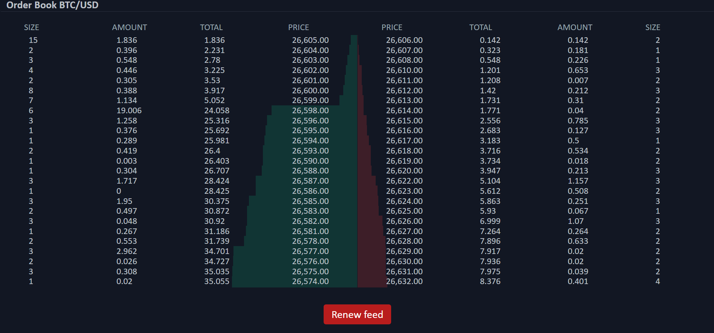
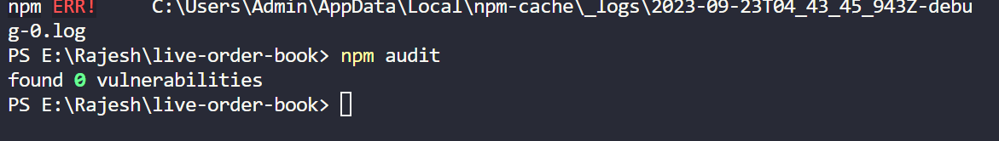
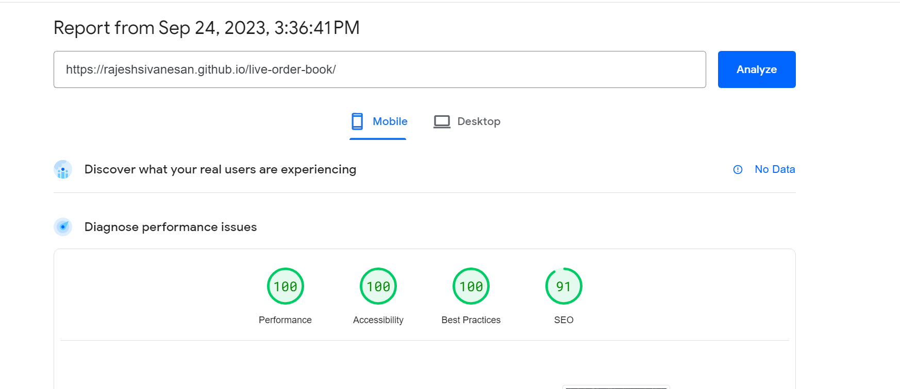
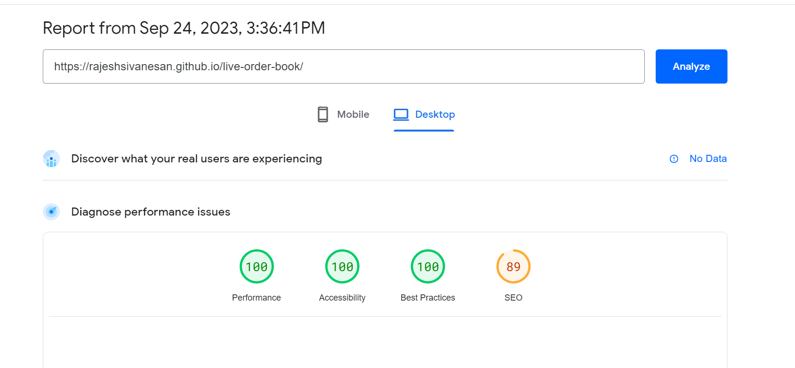

# Live Order Book
A real time Order Book app built with React/Typescript and powered by WebSockets.

<hr />

## Tech stack
 - React / Typescript / Javascript
 - SASS (Module)
 - WebSockets / react-use-websocket
 - react-testing-library
 - jest / React testing library
 - Redux / Redux Saga / Redux toolkit

### Demo Github Pages hosted URL
https://rajeshsivanesan.github.io/live-order-book/
 
### Screenshots









Note: Screenshots not showing up. Have uploaded to google drive
Please check - https://drive.google.com/drive/u/2/folders/11-r0yf9HAgqXP1X1JMaXBCr5lxnDHY5q

## Application features:
One extra feature i have incorporated for killing / renewing the feed.
### Display Order book in real time connected via WS
Connected to bitfinex ws url and subscribed for channels book.
### Processed the incoming data packets
Processed the data packets and splitted the data into bids / asks data structure for ui rendering.
### Real time syncing of the data
Handles the new / update / deletion scenario as per the rules defined on the 
given documentation website.
Used reduxjs toolkit / redux saga for manipulating the bids / asks data.
### On screen refresh, the previous data will be loaded
Used local storage to save the information, on load via redux it will be preloaded and rendered and then WS data processes.
### Kill Feed Button
1. Clicking this button stops the feed.
2. Clicking this button second time renews the feed.

### Running the app locally

To run the app, follow these steps.

1. Ensure that [NodeJS](http://nodejs.org/) is installed.
2. From the project folder, execute the following commands:

To clone the project
```shell
  git clone git@github.com:RajeshSivanesan/live-order-book.git
  OR
  git clone https://github.com/RajeshSivanesan/live-order-book.git
```

Move to the directory
```shell
  cd live-order-book
```

To install dependencies:
```shell
  npm install
```

To run the app:

```shell
  npm run dev
```

To launch the ui:

```shell
  Please check the url which prints post npm run dev
  Default - http://localhost:5173/
  If the port is busy, it will pick the next one - 5174
  so always keep an eye on the port number
```

To run the tests:

```shell
  npm run test
```
