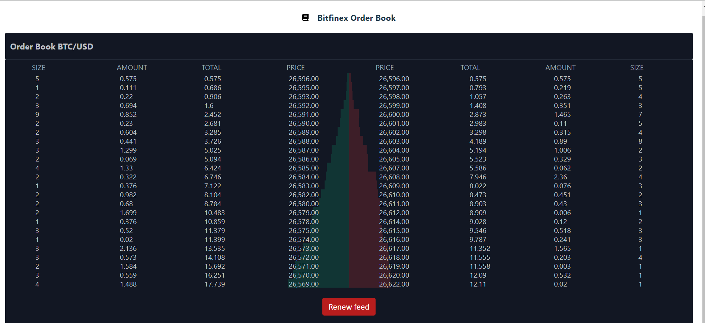
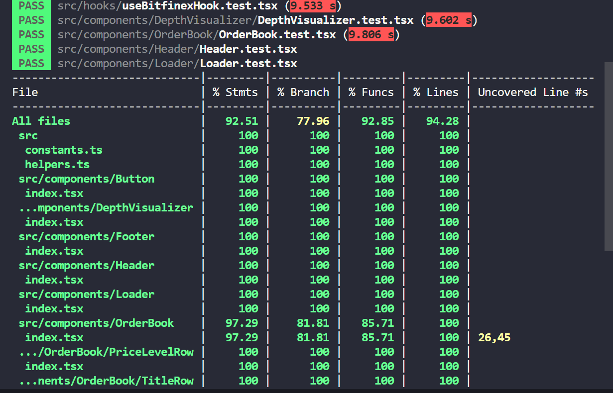

# Order Book
A real time Order Book app built with React/Typescript and powered by WebSockets.

<hr />

## Tech stack
 - React / Typescript
 - SASS
 - WebSockets / react-use-websocket
 - react-testing-library
 - jest
 - Redux / Redux Saga / Redux toolkit
 
### Screenshots




## Application features:
One extra feature i have incorporated for killing / renewing the feed
### Kill Feed Button
1. Clicking this button stops the feed.
2. Clicking this button second time renews the feed.

### Running the app locally

To run the app, follow these steps.

1. Ensure that [NodeJS](http://nodejs.org/) is installed.
2. From the project folder, execute the following commands:

To clone the project
```shell
  git clone git@github.com:RajeshSivanesan/live-order-book.git
  OR
  git clone https://github.com/RajeshSivanesan/live-order-book.git
```

Move to the directory
```shell
  cd live-order-book
```

To install dependencies:
```shell
  npm install
```

To run the app:

```shell
  npm run dev
```

To run the tests:

```shell
  npm run test
```
